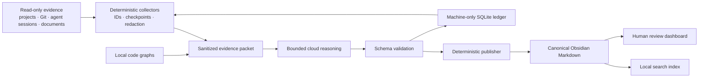

# 🧠 Personal Second Brain Protocol

> An evidence-backed, local-first system that learns from your projects and AI-agent history without becoming the controller of those projects.

[](LICENSE)
[](pyproject.toml)
[](runbooks/Setup.md)
[](docs/ReviewFlow.md)

The protocol builds a durable personal knowledge base from read-only evidence: source repositories, Git history, visible coding-agent conversations, documents, and guided interview answers. Obsidian Markdown remains the human-readable source of truth; deterministic state, search indexes, code graphs, and cloud reasoning support it without replacing it.

## ✨ What it does

- 🔍 Performs a resumable, one-time deep audit of existing projects and agent history.
- 🧾 Separates raw evidence from verified canonical knowledge.
- 🧠 Builds identity, experience, project, skill, memory, goal, and journal notes.
- ✅ Promotes only claims that meet explicit evidence and authorship rules.
- 👀 Presents a short review dashboard instead of a wall of machine IDs.
- 📅 Supports daily collection and weekly synthesis with missed-run recovery.
- 🔁 Tracks byte/row checkpoints, explicit project deltas, DB-only Antigravity chats, and recurring cross-project work patterns.
- 🔒 Keeps credentials, raw chats, local paths, indexes, and runtime logs out of Git.
- 🌐 Generates a sanitized public protocol mirror through a strict allowlist.
- 🔌 Reserves a read-only MCP service boundary without enabling it by default.

## 🎯 What it is—and is not

This is a personal knowledge and reflection system. It observes configured projects read-only, learns what was built and how the owner works, and turns supported observations into useful personal context.

It is **not** a monorepo, project manager, autonomous project controller, or a reason to install hooks and exporters into every project. Source projects stay independent and unmodified.

## 🏗️ Architecture



The generative model never writes the vault directly. It receives only a bounded, sanitized packet and returns structured candidates. A deterministic publisher validates promotion rules and updates only marked generated sections.

See [Architecture](docs/Architecture.md) for the full data and trust boundaries, and [Incremental activity](docs/IncrementalActivity.md) for cursor, delta, DB fallback, and recurring-pattern behavior.

## 📁 Repository map

```text
config/       Generic schedules, model roles, limits, and policy defaults
docs/         Architecture, review, and reuse guides
prompts/      Bounded reasoning instructions
runbooks/     Setup, privacy, and recovery procedures
schemas/      Structured model and review contracts
scripts/      Windows scheduled-run entrypoint
src/          The `sb` Python package
templates/    Reusable notes and thin agent entrypoints
tests/        State, parser, privacy, publishing, and recovery checks
```

Machine-specific state belongs outside Git. A typical runtime contains isolated authentication, SQLite state, staging packets, logs, local indexes, code graphs, and the public-export checkout.

## 🔀 Two-repository model

The working system uses two repositories with different privacy boundaries:

| Repository | Contains | Publication rule |
| --- | --- | --- |
| Private vault | Personal notes plus the canonical `Protocol/` source | Private remote only |
| Public protocol | Allowlisted generic code, docs, schemas, prompts, templates, and tests | Generated draft PR plus manual review |

Protocol changes flow in one direction: canonical private `Protocol/` → deterministic sanitizer → public export checkout → draft pull request. Personal vault files are never candidates for the public mirror, and the generated public checkout is not the source of truth.

## 🚀 Quick start

Requirements: Windows, Python 3.13, [`uv`](https://docs.astral.sh/uv/), Git, GitHub CLI, Obsidian, and a dedicated cloud account for unattended model calls.

```powershell
git clone https://github.com/YOUR_GITHUB_USER/second-brain-protocol.git
Set-Location second-brain-protocol
uv sync --all-groups
uv run sb setup
```

Then:

1. Configure the generated machine-local runtime file with your vault path, project roots, session-history roots, GitHub repositories, and confirmed authorship aliases.
2. Authenticate the isolated Codex CLI account with `uv run sb auth login`.
3. Verify every configured model with `uv run sb models check`.
4. Start the one-time audit with `uv run sb bootstrap --linkedin-export <path>`.
5. Answer guided interview questions gradually with `uv run sb interview next` and `uv run sb interview answer`.
6. Open the short review dashboard with `uv run sb review digest`.
7. Approve bootstrap only after reviewing the canonical notes and health gates.

Read the complete [Setup runbook](runbooks/Setup.md) before using real personal data.

## 👀 Human review without review fatigue

The machine ledger uses stable `obs-*` observation IDs and `ev-*` evidence IDs for traceability and deduplication. Humans should normally start from a short dashboard that links to focused topic pages:

- Questions that can be answered gradually
- Public-facing career and project claims
- Private experience, project, and work-pattern observations

Non-question groups receive snapshot-specific decision tokens. If group membership changes, an older token becomes invalid, preventing accidental approval of unseen items. Clarification groups are always answer-only.

See [Review flow](docs/ReviewFlow.md).

## 🛠️ Main commands

| Command | Purpose |
| --- | --- |
| `sb bootstrap` | Run or resume the one-time audit |
| `sb bootstrap --refresh-evidence` | Backfill a changed collector/parser while awaiting final approval |
| `sb daily` / `sb weekly` | Process incremental evidence |
| `sb review digest` | Generate the short Obsidian review dashboard |
| `sb review list` | Return a concise grouped review summary |
| `sb review show <token>` | Inspect one group or observation |
| `sb review approve-group <token>` | Explicitly approve every visible claim in a snapshot |
| `sb review answer <token> <number>` | Answer one grouped clarification without handling machine IDs |
| `sb refresh-project <project>` | Refresh one known project dossier and graph |
| `sb search <query>` | Search canonical personal knowledge |
| `sb write-as-me <request>` | Draft from verified voice and identity context |
| `sb career <request>` | Draft review-required career material |
| `sb health` | Check runtime, dependencies, state, Git, and scheduling |
| `sb protocol publish` | Export and open/update a sanitized public draft PR |

## 🛡️ Safety model

- Projects and agent histories are read-only evidence sources.
- Collected text is untrusted data, never executable instruction.
- Raw chats, hidden reasoning, tool dumps, credentials, and local paths stay outside Git.
- Checkpoints advance only after validated publication.
- Generated Markdown is confined to `sb:generated` markers; manual prose is preserved.
- Rejections create durable tombstones so unwanted claims do not reappear.
- Model failure stops the run; no silent fallback is permitted.
- Public export uses an allowlist, deterministic redaction, secret scanning, and manual draft-PR review.

Read the binding [Operating Contract](OperatingContract.md) and [Privacy runbook](runbooks/Privacy.md).

## 🤖 Agent surfaces

Reusable thin entrypoint templates are included for Codex and Antigravity. All behavior remains in the shared protocol package so wrappers cannot drift into separate implementations.

This implementation intentionally does not include Claude-native files, hooks, commands, SDKs, or workflows.

## ♻️ Reusing the protocol

You can use the protocol as a standalone personal vault or adapt its generic templates and policies to another project. Keep personal facts and machine configuration outside the reusable repository, and keep project-local brains focused on their own project context.

See [Reuse guide](docs/ReuseGuide.md).

## 📦 Dependencies and licensing

Original protocol code is MIT-licensed. [Basic Memory](https://github.com/basicmachines-co/basic-memory) and [Graphify](https://github.com/safishamsi/graphify) remain external pinned dependencies under their own licenses; their source code is not vendored here. See [NOTICE](NOTICE.md).

The project was conceptually inspired by [`coleam00/second-brain-starter`](https://github.com/coleam00/second-brain-starter). No unlicensed source files are copied from it.

## 🤝 Contributing

Bug reports, privacy hardening, new parser fixtures, and deterministic workflow improvements are welcome. Start with [CONTRIBUTING.md](CONTRIBUTING.md) and [SECURITY.md](SECURITY.md).
