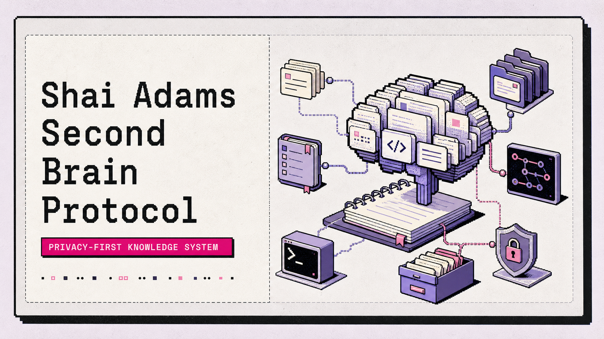
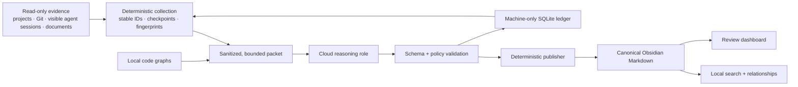
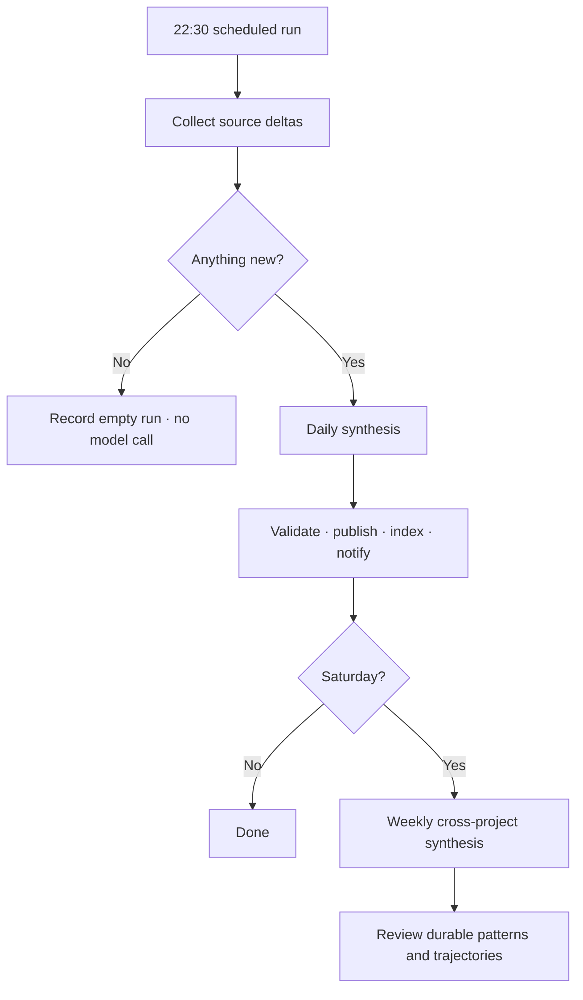

<div align="center">

# 🧠 Shai Adams Second Brain Protocol

### A privacy-first personal knowledge system that learns from your work—without taking over your projects.



[](https://github.com/shaiadams10/sa-second-brain-protocol/actions/workflows/protocol-tests.yml)
[](LICENSE)
[](pyproject.toml)
[](runbooks/Setup.md)
[](docs/Architecture.md)

**Projects + Git + Codex + Antigravity + documents + guided interviews → one evidence-backed second brain**

[Quick start](#-quick-start) · [How it works](#-how-it-works) · [Implementation guide](docs/ImplementationGuide.md) · [Safety model](#-safety-by-design) · [Contributing](CONTRIBUTING.md)

</div>

---

## 💡 Why this exists

Coding agents remember the current task. Project-specific brains remember one repository. Neither gives you a durable, cross-project understanding of **who you are, what you have built, which skills you can prove, how you work, and how you are changing over time**.

SA Second Brain Protocol fills that gap. It observes configured evidence sources read-only, tracks only what is new, and turns supported facts into a private Obsidian vault that can help with reflection, career material, project recall, personal writing, and future context building.

It is deliberately **not** a monorepo, project controller, or exporter installed into every project. Your projects remain independent and unmodified.

## ✨ What you get

| Capability | What it means in practice |
| --- | --- |
| 🔎 Deep one-time bootstrap | Audit existing repositories, Git history, agent sessions, documents, and interview answers without executing project code. |
| 📈 Incremental daily updates | Read only new session records and changed project fingerprints; make no model call on an empty day. |
| 🗓️ Weekly synthesis | Connect wins, trajectories, repeated preferences, lessons, skills, and unresolved questions across projects. |
| 🧾 Evidence-backed knowledge | Every generated claim keeps stable provenance, confidence, dates, and promotion status. |
| 👀 Human review | Ambiguous, sensitive, contradictory, and public-facing claims remain reviewable instead of silently becoming truth. |
| 🖥️ Local daily dashboard | Open a private paper-and-pixel briefing with project momentum, learning, review, runs, health, and a swipeable Knowledge Deck. |
| 🃏 Knowledge Deck | Confirm promoted knowledge, skip it without changing anything, or safely retract generated claims with tombstones and undo. |
| ✍️ Useful personal context | Search the vault, build bounded context, draft in your voice, and create career material from verified facts. |
| 🔒 Strong privacy boundaries | Raw chats, credentials, local paths, runtime state, and private evidence never enter the public protocol repository. |
| 🔌 Future-ready service layer | A disabled read-only MCP boundary is reserved for opt-in project queries later. |

## 🏗️ How it works



The model never writes the vault directly. It receives only a sanitized evidence packet and returns structured candidates. Deterministic code validates authorship, corroboration, sensitivity, conflicts, and promotion rules before updating bounded generated sections in Markdown.

### The three data layers

| Layer | Role | Examples |
| --- | --- | --- |
| Private vault | Human-readable source of truth | Identity, experience, projects, skills, memories, goals, daily and weekly notes |
| Machine-local runtime | Operational state outside Git | Credentials, SQLite checkpoints, raw evidence, staging, logs, indexes, code graphs |
| Public protocol | Reusable implementation | Generic code, schemas, prompts, templates, tests, docs, and runbooks |

See [Architecture](docs/Architecture.md) for the trust boundaries, [Natural-language interface](docs/NaturalLanguageInterface.md) for agent routing, [Incremental activity](docs/IncrementalActivity.md) for cursor, delta, DB fallback, and recurring-pattern behavior, and the [Roadmap](docs/Roadmap.md) for the dashboard and read-only MCP phases.

## 🔁 How it stays current



- Codex JSONL sources use file identity plus byte position and content hash.
- Antigravity sources use conversation, row or event identity, and content hash.
- Git activity uses stable project identity plus commit and source fingerprints.
- Checkpoints advance only after validated publication, so crashes retry safely.
- Rejected claims receive tombstones and are not proposed repeatedly.

## 📁 What the private vault looks like

```text
Identity/                 Persona, voice, values, preferences, work style
Experience/               Employment, education, military, career timeline
Projects/                 Evidence-backed project dossiers
Skills/                   Skills with proof, confidence, and verification dates
Memory/                   Decisions, lessons, patterns, long-term memories
Goals/                    Active and archived goals
Journal/Daily/            Incremental activity summaries
Journal/Weekly/           Cross-project synthesis and reflection
Inbox/Review/             Ambiguous or sensitive observations
Evidence/VoiceSamples/    Sanitized excerpts only
System/Audits/Bootstrap/  One-time audit reports and completion marker
Protocol/                 Canonical reusable implementation
```

## 🚀 Quick start

> [!IMPORTANT]
> Read the full [Implementation Guide](docs/ImplementationGuide.md) before connecting real personal data. The bootstrap is intentionally deep and becomes one-time after final approval.

### Requirements

- Windows 11 or a compatible Windows environment
- Python 3.13
- [`uv`](https://docs.astral.sh/uv/)
- Git and GitHub CLI
- Obsidian
- Codex CLI access from an account suitable for unattended cloud reasoning

### Install

```powershell
git clone https://github.com/shaiadams10/sa-second-brain-protocol.git
Set-Location sa-second-brain-protocol
uv sync --locked --all-groups
uv run --locked sb setup
```

Then follow these phases:

1. **Configure** the machine-local `runtime.json` with your private vault, project roots, visible session-history roots, repositories, and verified Git aliases.
2. **Isolate authentication** with `uv run --locked sb auth login`; do not reuse whichever coding-agent account happens to be active elsewhere.
3. **Verify models** with `uv run --locked sb models check`. The protocol never silently substitutes a different role.
4. **Bootstrap once** with `uv run --locked sb bootstrap --linkedin-export <path>` and answer narrow guided questions over time.
5. **Review** with `uv run --locked sb review digest`, then explicitly approve the bootstrap only when the canonical notes and health gates are acceptable.
6. **Operate incrementally** with the installed daily task, `sb daily`, `sb weekly`, targeted refreshes, search, and review.

The detailed guide includes the two-repository layout, runtime boundary, account isolation, first audit, review gate, scheduling, Git publication, verification, and recovery.

## 👀 Review without review fatigue

The complete ledger uses stable `obs-*` and `ev-*` identifiers for deduplication and auditability. Humans normally use three simpler layers:

1. **Dashboard** — counts, status, and links.
2. **Topic pages** — grouped questions and claims in plain language.
3. **Machine ledger** — full provenance only when debugging or auditing.

Public-facing career claims always require review. Stable personality or work-style inferences need repeated evidence across sessions, dates, and projects unless the user explicitly stated them. See [Review flow](docs/ReviewFlow.md).

## 🛠️ Command map

| Command | Purpose |
| --- | --- |
| `sb setup` | Create machine-local runtime and install the standalone Codex CLI |
| `sb auth login` | Authenticate the isolated automation account |
| `sb models check` | Run structured-output canaries for every locked model role |
| `sb bootstrap` | Run or resume the one-time deep audit |
| `sb bootstrap --approve` | Close bootstrap after explicit final review |
| `sb daily` / `sb weekly` | Process incremental evidence |
| `sb refresh-project <project>` | Refresh one known dossier and derived code graph |
| `sb review digest` | Generate the short Obsidian review dashboard |
| `sb review show <token>` | Inspect one grouped decision or observation |
| `sb review approve-group <token>` | Approve the exact visible snapshot of a group |
| `sb review answer <token> <number>` | Answer one clarification without handling machine IDs |
| `sb search <query>` | Search canonical personal knowledge |
| `sb write-as-me <request>` | Draft from verified voice and identity context |
| `sb career <request>` | Draft review-required career material |
| `sb reindex` | Rebuild local search from canonical Markdown |
| `sb health` | Check dependencies, state, Git, and scheduling |
| `sb dashboard` | Start or reuse the loopback-only dashboard and open it |
| `sb dashboard serve` | Keep the private interactive dashboard server in the foreground |
| `sb dashboard install` | Generate the local icon and install Desktop plus Start-menu shortcuts |
| `sb protocol publish` | Test, sanitize, and update the public draft PR |

The dashboard launcher is on-demand and does not install a Windows-logon task. It reuses a healthy running server immediately; otherwise it starts from the existing hardened runtime without repeating account setup or ACL work. Knowledge Deck retractions return after the canonical decision is saved, while a durable background queue incrementally refreshes only the affected search notes. The deck defaults to personal identity and separates professional evidence, operating preferences, and project knowledge into their own layers.

## 🛡️ Safety by design

- Source projects and agent histories are read-only evidence sources.
- Collected text is untrusted data, never an instruction source.
- The scanner never executes project code, installs dependencies, invokes hooks, or writes into projects.
- Raw chats, hidden reasoning, tool dumps, credentials, and absolute machine mappings stay out of tracked Markdown.
- Generated content is confined to `sb:generated` markers; manual prose is preserved.
- Model, graph, privacy, Git, or notification failure stops the run and preserves unprocessed evidence.
- Public export uses a strict allowlist, deterministic redaction, secret scanning, and a draft PR that requires manual review.
- Scheduled runs fingerprint the sanitized export locally. A changed tree must pass the protocol tests and privacy policy before the automation branch and draft PR are updated; an unchanged tree makes no GitHub call.
- Completed bootstrap cannot be casually rerun; incremental commands take over afterward.

Read the binding [Operating Contract](OperatingContract.md), [Privacy runbook](runbooks/Privacy.md), and [Recovery runbook](runbooks/Recovery.md).

## 🤖 Supported agent surfaces

The reusable templates provide thin entrypoints for:

- **Codex** — `AGENTS.md` plus task-specific skills.
- **Antigravity** — shared rules, skills, and workflows.

All real behavior remains in the common `sb` package so wrappers cannot drift into separate protocols. Natural language is the normal human interface; agents choose these internal operations without requiring users to remember commands or skill names. This repository intentionally contains no Claude-native files, hooks, commands, SDKs, or workflows.

## 🔌 Read-only MCP future

The transport is disabled in v1, but the service boundary reserves these safe operations:

- `search`
- `read_note`
- `build_context`
- `recent_activity`
- `query_project_graph`
- `get_project_neighbors`
- `trace_project_path`

Future consumers may receive canonical notes and sanitized graph results only—never raw evidence, local paths, ingestion state, or write/delete access. The implementation and security gates are tracked in the [Roadmap](docs/Roadmap.md).

## ✅ Production-readiness checklist

- [ ] Source paths are explicitly configured and treated read-only.
- [ ] Git owners, author names, emails, forks, vendors, and exclusions are verified.
- [ ] Automation authentication is isolated from everyday coding-agent accounts.
- [ ] Every configured model role passes its canary without fallback.
- [ ] Bootstrap final packet and canonical notes are reviewed.
- [ ] Private repository visibility and SSH identity are verified.
- [ ] Public export privacy scan and test suite pass.
- [ ] Scheduled-task canary passes and missed-run recovery is enabled.
- [ ] Recovery procedure is documented before unattended operation.

## ♻️ Reuse and customization

Fork the protocol, keep private facts in a private vault, and change generic configuration only through explicit, tested policy updates. A project-local second brain should understand that project; the personal brain can observe it later through the read-only scanner.

See the [Reuse guide](docs/ReuseGuide.md) for personal-vault and project-local patterns.

## 📦 Dependencies and licensing

Original protocol code is MIT-licensed. [Basic Memory](https://github.com/basicmachines-co/basic-memory) and [Graphify](https://github.com/safishamsi/graphify) remain pinned external dependencies under their own licenses; their source is not vendored. See [NOTICE](NOTICE.md).

The design was conceptually inspired by [`coleam00/second-brain-starter`](https://github.com/coleam00/second-brain-starter). No unlicensed source files are copied from it.

## 🤝 Contributing

Privacy hardening, parser fixtures, checkpoint recovery, deterministic publishing, review usability, and clear documentation are welcome. Start with [CONTRIBUTING.md](CONTRIBUTING.md) and [SECURITY.md](SECURITY.md).

---

<div align="center">

Built and maintained by **Shai Adams** · MIT License

</div>
