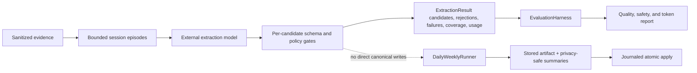

# 🏗️ Architecture

The protocol is built around one rule: evidence may suggest knowledge, but only deterministic policy may publish it.

## Trust boundaries

### 1. Read-only sources

Configured project roots, Git repositories, Codex session history, Antigravity history, and imported documents are evidence sources. Collectors may read them but never execute project code, install dependencies, invoke hooks, or write files into those sources.

### 2. Machine-local state

SQLite checkpoints, source identities, evidence records, model receipts, staging packets, search indexes, code graphs, locks, and logs live outside Git. This state supports deduplication, crash recovery, and provenance without making the private vault unreadable.

### 3. Sanitized reasoning workspace

Each cloud run receives a temporary Git workspace containing only a bounded sanitized packet, a task prompt, and an output schema. For session digests, the packet is a strict allowlist: raw session identifiers, raw artifacts, full transcripts, raw tool output, credentials, local paths, email addresses, URLs, network addresses, phone-like values, and code blocks are excluded or redacted before transport. The packet carries its evidence-policy version and session lane. The automation account denies access to source projects, normal agent history, credentials, the user profile, network tools, connectors, and unrelated skills.

### 4. Deterministic publication

Structured model output is schema-validated. Promotion policy checks evidence type, authorship, corroboration, sensitivity, conflicts, and public-facing intent. The publisher—not the model—updates canonical Markdown inside named `sb:generated` sections.

### 5. Human review

Claims that are public-facing, contradictory, under-evidenced, or ambiguous remain pending. The human dashboard groups them by decision type while the full evidence ledger remains machine-oriented.

## Canonical and derived data

| Layer | Canonical? | Examples |
| --- | --- | --- |
| Obsidian Markdown | Yes | Identity, experience, projects, skills, memory, goals, journals |
| SQLite state | Operational | Evidence IDs, observations, tombstones, checkpoints, run ledger |
| Basic Memory index | Derived | Search vectors and note relationships |
| Graphify graphs | Derived | AST-based project and cross-project code graphs |
| Local dashboard | Derived plus narrow owner feedback | Safe briefing and Knowledge Deck served only on loopback; static fallback remains read-only |
| Model output | Candidate only | Proposed summaries, claims, updates, and review items |

Derived indexes may be rebuilt. Canonical Markdown and explicit review decisions must remain durable.

The dashboard is also rebuildable. Its generic template and deterministic generator belong to the protocol, while its populated HTML stays outside Git. It may contain canonical summary excerpts, the complete generated sections of daily/weekly notes, safe pending-question text, and aggregate operational metadata, but never raw evidence, unresolved candidate-claim wording, credentials, local paths, session identifiers, or staging packets. Its compact personality portrait is deterministically assembled from the canonical Identity notes: six labeled facets show at most two recent grounded signals each, empty facets remain visibly “forming,” and no psychometric scores or model-invented traits are generated for display.

An optional installed-skill guide may be generated from an explicit safe allowlist. It exposes only skill names, invocation mode, compact usage guidance, dependencies, and workflow position; it never renders skill source text, local paths, executable instructions, or arbitrary installed packages.

Interactive dashboard actions pass through a separate loopback-only boundary. The server binds to `127.0.0.1`, serves no arbitrary files, validates same-origin requests with an in-memory token, limits request bodies, and exposes only confirm, retract, undo, answer-question, dismiss-question, and undo-question-dismissal routes. Confirm writes operational feedback only. Retract invokes the deterministic publisher to remove the observation exclusively from valid generated sections and records a durable rejection tombstone. Undo restores the last retraction. A question answer is first sent through the same sanitized external boundary to a dedicated structured evaluator. The raw textarea response is not written as memory; only normalized, privately routed claims are stored, and public use remains false until separately approved. A question dismissal records that its category was not relevant without inventing a reason; undo restores the latest safely matched dismissal. Both actions refresh the derived review dashboard. Manual prose and raw provenance are never deleted.

Search indexing remains derived and must not delay an explicit owner decision. Retraction and undo queue their changed Markdown paths in the same SQLite transaction as the decision, return immediately, and wake one debounced background worker. The worker updates only those files in the Basic Memory mirror and retries durable queue entries after a failure or restart. While a retraction is waiting to be indexed, service search filters its tombstoned claim and observation ID so stale derived results cannot resurface removed knowledge.

Daily and weekly synthesis periods persist an explicit evidence mapping in local state. The dashboard uses that mapping to build sanitized, hoverable provenance surfaces and canonical Obsidian links for project changes, session coverage, patterns, and stewardship claims. Legacy summaries may recover the same mapping from machine-local validated model-cache receipts, but raw cache content is never rendered. Journal indexes are deterministic bounded publishers, not manually maintained lists.

The human Knowledge Deck separates promoted observations into four deterministic layers. **About the person** contains identity, voice, work style, personality, enduring facts, and goals. **Professional profile** contains capabilities, experience, education, service, and verified skills. **Operating preferences** contains reusable agent behavior, formats, validation rules, design taste, and protocols. **Project knowledge** contains decision-relevant project status, ownership, decisions, and lessons. Routine stack inventories, feature lists, technical trivia, and one-off project instructions remain in project summaries instead of becoming Curate cards. Project-scoped cards carry a visible project-attribution stamp; reusable preferences stay in the operating layer even when their evidence originated in one project.

Time-varying understanding is kept separate from permanent identity. A longitudinal learning registry records dated evidence for learning edges, demonstrated understanding, later application, architectural judgment, operational capability, validated outcomes, and counterevidence under stable topic keys. Its deterministic current state and cross-session/date/project/context breadth are published to `Memory/Learning.md`. An open edge is explicitly temporary and later correct use may supersede it.

The question deck surfaces only owner-judgment questions and defers agent-resolvable technical gaps. Every question declares its project/profile destination and shows available project attribution. The interface intentionally provides no invented answer starter or Tab-completion text. The owner answers naturally, a structured model evaluation separates durable claims from filler, and the host verifies project IDs and destination lanes before storage. Project resolution considers the complete project catalog instead of favoring a noisy source-session candidate; an explicit owner correction is stored on the pending observation and overrides inference for both the visible stamp and any later evaluated answer.

Every direct child of a configured projects root is scanned as a candidate identity, regardless of its name or technology markers. Collection behavior is explicit and path-scoped: only configured organizational folders are treated as zero-count containers, and their direct children are scanned independently. Ordinary projects never become collections merely because they contain nested repositories or source trees. The canonical catalog then separates three roles deterministically: leaf folders with project content become projects, configured collection containers remain collections, and content-free candidates remain visible only as other folders rather than masquerading as projects. Generic directories such as `src`, `app`, `packages`, and `lib` are suppressed when encountered recursively inside a real project, preventing accidental project explosion. The deterministic publisher rejects machine-resolvable questions, multi-project questions, mixed-decision questions, and project questions whose evidence does not resolve to exactly one named leaf project.

`Projects/Index.md` is rebuilt from the latest scanner result inside its bounded generated section. Project names and note paths come from scanner metadata; a model may update the knowledge section of a known leaf dossier but cannot append an alias, create a collection dossier, or choose the catalog identity. Duplicate scanner identities are omitted, collection containers are shown separately, and stale generated index entries disappear on the next catalog sync while manual prose remains untouched. Health compares the generated catalog with the present runtime registry so drift is visible.

Knowledge confirmation/removal and question answering/dismissal form an implicit feedback profile. The profile stores only aggregate content or question categories and counts, never a guessed free-text reason. Daily, weekly, and reusable bootstrap synthesis use those aggregates as ranking guidance, while deterministic guards suppress categories that the owner repeatedly removes or dismisses with a strong negative ratio. Feedback metadata is not biographical evidence and can never justify a personal claim.

Dashboard snapshots batch project and evidence reads for each deck instead of querying once per card. Independent scheduler and automation-account status checks run concurrently, keeping a browser refresh bounded as the review inventory grows.

## One-time bootstrap

```text
not_started → collecting → synthesis_ready → awaiting_review → completed
```

Pre-completion runs resume from checkpoints. After approval, bootstrap is permanently closed and incremental refresh commands must be used.

## Incremental operation

### Governed extraction and evaluation harness

The replacement pipeline is split across four narrow public seams: `ExtractionHarness.extract(ExtractionRequest) -> ExtractionResult`, `EvaluationHarness.evaluate(EvaluationSuite) -> EvaluationReport`, `DailyWeeklyRunner.run(RunRequest) -> RunReceipt`, and `RecallHarness.retrieve(RecallRequest) -> RecallPacket`. Extraction, orchestration, retrieval, and publication remain separate so no model response can write notes, mutate checkpoints, or hide retrieval behavior.



Episode construction losslessly fragments long messages to the stricter of configured and privacy-transport limits, preserves deterministic source derivation, and validates each model response against only the exact evidence packet that produced it. Profile-only evidence fails closed for project knowledge. Full-lane project memories must name the single authoritative project carried by every cited evidence item. Malformed model envelopes, individual model-call failures, unknown citations, invalid candidates, privacy-unsafe candidate fields, and policy violations remain isolated and privacy-safe; a valid sibling can survive without making the failed episode publishable.

The authoritative `DailyWeeklyRunner` derives session and period summaries only from extraction receipts; it never re-reads raw sessions. Its replay key covers every sanitized bounded model packet after episode expansion, the run kind and period, limits, runner behavior contract, prompt/schema/policy fingerprint, and explicit model contract. The extraction contract is sampled once before extraction, used for both the replay and artifact identities, and checked again before persistence; an in-flight prompt, schema, or policy change fails the run instead of mislabeling its output. A compatible eligible artifact is reused before model invocation. A blocked artifact is retried for the same input and may be replaced only until an eligible attempt succeeds; the eligible artifact is then immutable. Any failed episode, malformed or omitted message, or incomplete episode ledger blocks checkpoint eligibility.

Publication is a separate scheduler-wired boundary. `AtomicApplyGate` recomputes eligibility and artifact integrity from the stored artifact, rejects artifacts from an obsolete extraction/privacy contract, and resolves an issued authorization bound to the exact run, period, behavior contract, and artifact. `JournaledApplyCoordinator` defines the durable recovery sequence `prepared -> files_committed -> completed`; before canonical files can commit, preflight persists each cited sanitized episode with its artifact-bound hash and exact source derivation. The transactional state owner then stores exact evidence/checkpoint advances, review-only memory and procedure proposals, the changed-note index queue, and the apply receipt together. Selected evidence must still be `new`; its authoritative derivation ancestors may already be `compacted` or `processed`, and the whole eligible closure is marked processed in the same transaction. Apply identity is anchored to the run artifact, while each issued authorization is durably bound to only one operation.

The staged publication carries sorted path/content hashes. Recovery reopens the same staging record, reruns the dedicated canonical-write policy, and verifies current canonical bytes before state can advance. Existing notes may change only inside unchanged `sb:generated` marker pairs; new files are limited to governed Daily/Weekly journal names and every newly authored byte, including frontmatter and headings, passes the privacy preflight. Protocol files, root agent instructions, and user-authored prose are not writable through this gate. SQLite-backed artifact, journal, authorization, and apply-state adapters support process-restart recovery; in-memory variants remain test references. The installed scheduler now enters through these adapters.

Accepted extraction candidates are next converted into deterministic review proposals with stable memory, mutation, and version identities. Create, reinforce, update, supersede, and contradict are distinct operations; same-batch conflicts and domain-mismatched targets fail closed. The mutation plan is part of the artifact fingerprint and its pending proposals are staged atomically with an authorized apply. The SQLite memory registry records pending proposals separately from operational memory heads, and it can advance a head only after the existing review command publishes the exact canonical destination and a trusted verifier proves its file hash and mutation marker. Reinforcement preserves the current version; updates and contradictions preserve evidence-backed version edges. Canonical Markdown remains authoritative.

Before mutation planning, a deterministic host-side novelty filter compares each candidate with every observation status, prior governed proposals, and canonical Markdown. Promoted or otherwise established repeats become `stale-established-memory`; previously rejected repeats become `rejected-memory-tombstone`. Both are removed from period summaries, journal proposals, and the active review queue. Comparison is local SQLite/Markdown work and consumes no model tokens. Project-scoped comparisons require the same exact project ID, including canonical project notes, so a valid fact in one project cannot suppress a separate project's candidate. A materially changed claim, including changed numeric facts or negation, remains eligible. The owner-authorized cutover established one auditable baseline by retiring the pre-cutover evidence backlog and active pre-cutover review queue without deleting canonical notes; the archived rows remain in SQLite and source checkpoints were reconciled through compacted evidence ancestry.

A separate procedure lane accepts only full-session evidence that directly shows owner direction and a validated outcome. A procedure proposal must include prerequisites, ordered steps, failure branches, tests, scope, project attribution, and exact evidence references. It is staged into a review queue during atomic apply. Approval returns a `skill-creator-review-required` handoff and never writes `.agents/skills/` itself.

Changed-note indexing has a separate segment-manifest foundation. Canonical Markdown is split into bounded, heading-aware segments whose IDs depend on canonical source identity, normalized stored text, and duplicate occurrence. BOM/CRLF frontmatter is excluded, malformed frontmatter fails before mutation, and path aliases cannot claim the same case-insensitive source identity. Reordered unchanged segments retain their IDs; changed text becomes one delete plus one upsert; note deletion removes only that note's segments. Backend mutation and manifest replacement serialize across processes. The scheduled authoritative pipeline now computes exact added/changed/deleted canonical paths and updates only those notes in the Basic Memory mirror; the typed segment backend remains a separate cutover component.

Evaluation corpora are versioned JSON under `evaluation/corpora/`. Deterministic replay is model-free. Optional live quality runs require an explicit cost confirmation and positive model-call ceiling, use the dedicated extraction prompt/schema, disable result caching so measured usage is honest, and never write canonical Markdown or advance collection checkpoints. Weekly question resolution is intentionally outside this memory-only harness and remains a separate runner responsibility.

The installed Daily/Weekly scheduler is authoritative on `governed-extraction-v3`. `sb daily`, `sb weekly`, and `sb scheduled` share the governed runner; the task command and 10:30 PM schedule did not change. Daily processes new source evidence and emits one review-only weekly feeder. Weekly consumes those Daily summaries for the target ISO week rather than reopening already-processed raw session evidence. Bootstrap and explicitly requested project-history refreshes retain their own bounded synthesis operation; neither can execute or publish as a Daily or Weekly.

Recall is isolated behind `RecallHarness.retrieve(RecallRequest) -> RecallPacket`. The harness accepts only canonical candidates, rejects sensitive, absolute, URI-shaped, hidden-environment, raw-evidence, and stale-index paths, and gives every canonical note one opaque path-stable source ID shared by all channels. A direct lexical adapter scans canonical Markdown; the Basic Memory adapter invokes vector-only retrieval so a channel ablation is not secretly hybrid. Reciprocal-rank fusion deduplicates each channel, poisons conflicting cross-channel source identities, sanitizes snippets, truncates a high-ranked hit before considering a lower-ranked one, and budgets the complete serialized packet rather than hit text alone. A final privacy preflight traverses the whole transport object.

`RecallGateway.retrieve(GatewayRecallRequest) -> GatewayRecallPacket` adds durable caller grants and purpose profiles for private general use, writing voice, public career material, resumes, recent projects, and one-project handoffs. It enforces project, layer, sensitivity, confirmation, public-ready, result-count, diversity, and complete-packet budgets after retrieval. Every returned excerpt must still occur in current canonical Markdown. Aggregate and generated notes fail closed unless a hit carries an exact current segment ID and hash bound to a currently approved observation whose normalized claim matches that segment; canonical identity, layer, project, verification time, sensitivity, and public-ready state are derived from current canonical/review records rather than caller input. Changed canonical bytes, deleted segments, project reclassification, and rejected or resolved observations invalidate the hit. Optional telemetry stores only purpose, query hash, returned canonical/segment IDs and scores, outcome, latency, and packet size—never query text, excerpts, or new biographical evidence. The transport remains disabled until opt-in deployment and MCP security review.

Graph expansion is disabled by default, requires at least one safe direct seed, and records whether expansion actually executed. The strict versioned recall corpus runs model-free through `sb harness recall` and reports source recall, irrelevant-context rate, latency, full packet size, and separate lexical, vector, and graph recall lift. Paired comparisons must keep the query, gold set, forbidden set, result limit, and character/token budgets identical while changing exactly one channel. Synthetic lift proves the ablation and fusion machinery; it does not by itself authorize vector or graph retrieval for the live vault. Those channels remain opt-in until a representative reviewed gold set shows useful marginal recall without unacceptable noise, latency, or packet cost. Graphify's AST project graphs are not treated as a general personal-memory graph.

Daily runs collect new evidence, skip the model on empty days, evaluate each session through both project and person lenses, synthesize one bounded update, publish a terse change recap plus explicit coverage details, update the learning and pattern registries, reindex, and notify. Weekly runs add a short trajectory recap, cross-project lessons, stable patterns, learning progression, and review-backlog summaries. Byte/row cursors avoid reparsing published history, project snapshots produce explicit before/after deltas, and durable registries accumulate semantically repeated preferences and topic-level learning evidence across sessions before promotion or state change.

Canonical notes intentionally contain synthesized durable knowledge, not a queryable copy of raw conversations. Exact latest-session requests therefore use a bounded machine-local lookup that returns sanitized surface, time, project attribution, and last-visible-user-message fields. This preserves the source trust boundary while supporting questions that canonical search cannot answer exactly.

Session collection is metadata-first. A local session-source index reads the Codex header, Antigravity database metadata, or Antigravity aggregate hub metadata before any visible-message body and resolves it to at most one current leaf project through current paths, historical aliases, or unique Git identity. A uniquely matched session enters the `full` analysis lane. A missing or conflicting attribution enters the isolated `profile_only` lane: visible messages and bounded tool metadata may support only person, voice, preference, pattern, goal, and learning analysis. Deterministic publication rejects profile-only evidence used for project facts, project updates, project decisions or lessons, ownership, authorship, skill verification, validated project outcomes, project session summaries, or project-question resolution. For Antigravity conversations marked outside a project, absolute paths embedded in project-facing file and command tool records may recover attribution only when every resolvable path identifies the same project; commands, tool output, reasoning, and path strings are never published. An explicit owner-confirmed session link is stored in machine-local configuration and outranks missing metadata. The project-session index is authoritative for recent-session views and digest attribution. Collection containers cannot own sessions, conversation text cannot create a link, and an ambiguous session is attached to no project rather than several.

All external-model packets share a hard secret boundary. Recognized credentials, authentication material, private keys, secret-file objects such as `.env` and credential stores, and sensitive identity-document files are removed before transport. Session packets apply a narrower allowlist and additional redaction for paths, contact details, URLs, network values, code, raw artifacts, and raw identifiers. A final preflight scans the fully serialized packet immediately before the model call and aborts transport if a recognized secret remains. Bounded sanitized work and personal context can still reach the configured private cloud model; this is a privacy-filtered cloud design, not a zero-data-cloud or fully local-model design.

Historical session backfill adds a second isolation boundary. Model calls are partitioned by the authoritative project-session index, and the deterministic host accepts only one project update whose ID and cited digests match that packet. All other model output categories are discarded for this operation, preventing a project-history repair from modifying personal identity, career, persona, voice, skills, reusable patterns, or the review-question queue.

Failures preserve unprocessed evidence and do not advance checkpoints.

## Project forgetting

Project disappearance and project forgetting are separate states. A scan that no longer sees a known folder marks it missing, records one removal delta, excludes it from the active catalog and new session attribution, and reports it in health output. It does not erase knowledge because a move, disconnected drive, or accidental deletion is indistinguishable from intentional retirement. If the folder returns, the same project identity is reactivated.

Project forgetting is an explicit destructive operation with a read-only preview and required confirmation. Matching is exact, similarly named protected projects are excluded, and a machine-local backup is created before mutation. The operation removes the project catalog identity, project-specific observations and questions (including orphaned questions that name the exact project), canonical dossier, generated review artifacts, direct project evidence, graph/cache artifacts, and search entries. Shared evidence is stripped of the forgotten project identity; evidence still required by unrelated canonical facts or capability notes is reduced to a content-free support stub rather than deleting durable cross-project learning. The source directory is added to the ignored-path list so later collection cannot reintroduce it. Source repositories are never modified or deleted.

See [Project and session lifecycle](ProjectSessionLifecycle.md) and [Incremental activity and recurring-pattern tracking](IncrementalActivity.md).

## Future MCP boundary

The governed Gateway and its policy tests exist, but MCP transport remains disabled and there is no client configuration to use yet. A later authenticated, per-project opt-in deployment may expose bounded Gateway packets for context-scoped reads and a separate size-bounded Curate-candidate submission. Projects remain isolated from one another: each caller receives only its grant, purpose, layer, sensitivity, confirmation, result-count, and packet-budget scope.

Candidate submission is not canonical write access. The private Brain validates provenance, project attribution, sensitivity, conflicts, and promotion rules. A caller's certainty is never sufficient by itself; only deterministic host policy may confirm an objective safe claim, while ambiguous or inferred knowledge remains owner-reviewable. Raw evidence, arbitrary paths, ingestion state, grant administration, telemetry administration, and canonical write/delete operations remain unavailable.

## Public protocol synchronization

The private vault's `Protocol/` tree is canonical. After each scheduled run, a deterministic allowlist exporter produces a sanitized generic tree and hashes that exported result—not the private source tree. If the fingerprint matches the last successful publication, the process stops locally without contacting GitHub. If it changed, the full protocol test suite and privacy scan must pass before the automation branch and draft pull request are updated. The fingerprint advances only after a successful push. Failures retry on a later scheduled run, and public `main` always requires manual review and merge.
